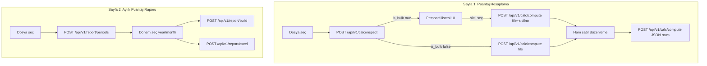

# Frontend API Referansı (Next.js)

Ürün / ekran tanıtımı için önce: [`PROJECT_OVERVIEW.md`](./PROJECT_OVERVIEW.md).

Bu doküman, Streamlit demo arayüzündeki **iki sayfa** akışını Next.js frontend’e taşırken kullanılacak **API sözleşmesi**dir. Backend FastAPI’dir, **stateless** çalışır: sunucu dosya tutmaz; her istekte dosyayı yeniden gönderirsiniz (veya düzenlenmiş satırları JSON olarak iletirsiniz).

- OpenAPI / Swagger UI: `{API_BASE}/docs`
- ReDoc: `{API_BASE}/redoc`

---

## 1. Ortam ve temel ayarlar

| Değişken | Nerede | Örnek |
|----------|--------|--------|
| `NEXT_PUBLIC_API_URL` | Next.js | `https://your-api.vercel.app` (trailing slash yok) |
| `CORS_ORIGINS` | FastAPI (Vercel env) | `https://your-app.vercel.app,http://localhost:3000` |

Yerel geliştirme:

```bash
# Bağımlılıklar (API / Vercel)
pip install -r requirements.txt

# Streamlit demo için ayrıca:
pip install -r requirements-streamlit.txt

# Backend (repo kökünden) — Vercel entrypoint ile aynı
uvicorn main:app --reload --port 8000

# Yerel Streamlit demo (Vercel'e gitmez)
# streamlit run streamlit_demo.py

# Frontend
# NEXT_PUBLIC_API_URL=http://localhost:8000
```

```ts
// lib/api.ts
export const API_BASE =
  process.env.NEXT_PUBLIC_API_URL?.replace(/\/$/, "") ?? "http://localhost:8000";
```

CORS varsayılanı `*`’dır (kimlik bilgisi/cookie yok). Production’da `CORS_ORIGINS` ile frontend origin’lerini sabitleyin.

**Auth yok.** İleride API key eklenebilir; şimdilik public endpoint varsayın.

---

## 2. Streamlit sayfa ↔ API eşlemesi



| Streamlit | Endpoint |
|-----------|----------|
| Dosya yükle → personel listesi / tekil tespit | `POST /api/v1/calc/inspect` |
| Personel detay hesaplama | `POST /api/v1/calc/compute` (multipart) |
| Ham veri `data_editor` sonrası yeniden hesap | `POST /api/v1/calc/compute` (JSON) |
| Rapor dönemi selectbox | `POST /api/v1/report/periods` |
| Matris / özet / haftalık / detay sekmeleri | `POST /api/v1/report/build` |
| Excel indir | `POST /api/v1/report/excel` |
| Sabitler / kod efsanesi | `GET /api/v1/meta` |

---

## 3. Ortak sözleşmeler

### 3.1 Dosya yükleme

- Content-Type: `multipart/form-data`
- Alan adı: **`file`** (zorunlu)
- Uzantılar: `.csv`, `.xlsx`, `.xls`
- CSV: `;` ayraç; encoding denemeleri: cp1254, utf-8, utf-8-sig, latin-1

```ts
function appendFile(form: FormData, file: File) {
  form.append("file", file, file.name);
}
```

### 3.2 Saat formatı

| Bağlam | Format | Örnek |
|--------|--------|--------|
| Calc `daily` / `weekly` / `leave_breakdown.Saat` | `HH:MM` string | `"09:00"`, `"45:30"` |
| Calc `summary.toplam_nm` | number (saat) | `162.5` |
| Calc `summary.toplam_nm_fmt` | `HH:MM` | `"162:30"` |
| Report `summary["Normal Çalışma"]` | number | `157.5` |
| Report `summary["Normal Çalışma_fmt"]` | `HH:MM` | `"157:30"` |

UI’da metrik göstermek için `*_fmt` alanlarını tercih edin; grafik/toplam için number alanlarını kullanın.

### 3.3 Placeholder değerler

Meyer boş hücreleri `#__#` veya boş string olabilir. Backend bunları **0 saat** sayar. Frontend ham satır editöründe bu değerleri olduğu gibi gösterebilir.

### 3.4 Hata gövdesi

HTTP `400` (iş kuralı), `422` (FastAPI validation), `500` (beklenmeyen):

```json
{
  "detail": {
    "code": "EMPLOYEE_NOT_FOUND",
    "message": "Sicil bulunamadı: 00123"
  }
}
```

| code | Anlam |
|------|--------|
| `INVALID_FILE` | Dosya boş, uzantı hatalı veya parse edilemedi |
| `MISSING_COLUMNS` | Zorunlu sütunlar yok |
| `EMPLOYEE_NOT_FOUND` | Toplu dosyada sicil yok / sicilno eksik |
| `NO_PERIODS` | Geçerli dönem / kayıt yok |
| `INVALID_PERIOD` | `month` 1–12 dışı veya dönemde veri yok |

```ts
export type ApiErrorBody = {
  detail: { code: string; message: string } | string | Array<unknown>;
};

export async function parseApiError(res: Response): Promise<string> {
  try {
    const body = (await res.json()) as ApiErrorBody;
    if (typeof body.detail === "object" && body.detail && "message" in body.detail) {
      return `${body.detail.code}: ${body.detail.message}`;
    }
    return JSON.stringify(body.detail);
  } catch {
    return res.statusText;
  }
}
```

---

## 4. Endpoint referansı

### `GET /health`

```json
{ "status": "ok" }
```

### `GET /api/v1/meta`

Sabitler ve rapor kod efsanesi. Uygulama açılışında bir kez çekip cache’leyin.

```ts
export type MetaResponse = {
  weekly_max_hours: number; // 45
  daily_work_hours: number; // 9
  sunday_cut_absence_hours: number; // 9
  unpaid_leave_column: string; // "UCZIZS"
  gun_durumlari: string[];
  day_names: string[];
  code_legend: { kod: string; aciklama: string }[];
  status_labels: Record<string, string>;
  calc_required_columns: string[]; // mesaitarih, NM, FM
  report_required_columns: string[]; // sicilno, Ad, Soyad, mesaitarih, NM, FM
  meyer_hour_columns: string[];
};
```

```ts
const meta = await fetch(`${API_BASE}/api/v1/meta`).then((r) => r.json());
```

---

### `POST /api/v1/calc/inspect`

Dosyayı tanı: toplu mu, personel listesi nedir?

**Request:** `multipart/form-data` → `file`

**Response:**

```ts
export type Employee = {
  sicilno: string; // "00123" (5 hane zero-pad)
  Ad: string;
  Soyad: string;
  Kayıt: number;
  Firma?: string | null;
  Bölüm?: string | null;
  Pozisyon?: string | null;
};

export type InspectResponse = {
  is_bulk: boolean;
  record_count: number;
  employees: Employee[];
};
```

```ts
export async function inspectCalcFile(file: File): Promise<InspectResponse> {
  const form = new FormData();
  form.append("file", file, file.name);
  const res = await fetch(`${API_BASE}/api/v1/calc/inspect`, {
    method: "POST",
    body: form,
  });
  if (!res.ok) throw new Error(await parseApiError(res));
  return res.json();
}
```

**UX önerisi**

1. Kullanıcı dosya seçer → `inspect`
2. `is_bulk === true` → personel tablosu (client-side arama: Ad/Soyad)
3. Satır tıklanınca `sicilno` ile `compute`
4. `is_bulk === false` → doğrudan `compute` (sicilno opsiyonel)

Client’ta `File` nesnesini state’te tutun; her `compute` çağrısında aynı `File`’ı yeniden gönderin.

---

### `POST /api/v1/calc/compute`

İki mod (Content-Type’a göre):

#### A) Multipart (dosyadan)

| Alan | Tip | Zorunlu |
|------|-----|---------|
| `file` | file | evet |
| `sicilno` | string | toplu dosyada **evet**; tekilde hayır |

```ts
export type CalcSummary = {
  toplam_nm: number;
  toplam_fm: number;
  toplam_nm_fmt: string;
  toplam_fm_fmt: string;
  ucretli_izin_gun: number;
  ucretli_izin_saat: number;
  ucretli_izin_saat_fmt: string;
  ucretsiz_izin_gun: number;
  ucretsiz_izin_saat: number;
  ucretsiz_izin_saat_fmt: string;
  devamsizlik_gun: number;
  devamsizlik_saat: number;
  devamsizlik_saat_fmt: string;
  calisma_gun: number;
  pazar_yanan_hafta: number;
  donem: string; // "01.03.2026 – 31.03.2026"
  toplam_gun: number;
  iso_hafta_sayisi: number;
  kisami_hafta_sayisi: number;
  tam_hafta_sayisi: number;
  employee_label?: string;
  sicilno?: string;
};

export type ComputeResponse = {
  summary: CalcSummary;
  leave_breakdown: Array<{
    Kategori: string;
    Gün: number;
    Saat: string; // HH:MM veya "—"
    Kaynak: string;
  }>;
  daily: Array<{
    Tarih: string;
    Gün: string;
    "Gün Durumu": string;
    "İzin Türü": string;
    "NM (Güncel)": string;
    "FM (Güncel)": string;
    "Ücretli İzin": string;
    "Ücretsiz İzin": string;
    "Devamsızlık Saat": string;
  }>;
  weekly: Array<{
    Hafta: string;
    Kapsam: string;
    "Gün (dosyada)": number;
    Tür: "Kısmi" | "Tam" | string;
    "Hafta İçi NM": string;
    "Hafta Sonu FM": string;
    "Toplam NM": string;
    "Toplam FM": string;
    "Pazar Durumu": "Yanar" | "Hak Edildi" | string;
  }>;
  /** Ham + türetilmiş sütunlar (tam detay tablosu) */
  processed: Record<string, unknown>[];
};
```

```ts
export async function computeFromFile(
  file: File,
  sicilno?: string,
): Promise<ComputeResponse> {
  const form = new FormData();
  form.append("file", file, file.name);
  if (sicilno) form.append("sicilno", sicilno);
  const res = await fetch(`${API_BASE}/api/v1/calc/compute`, {
    method: "POST",
    body: form,
  });
  if (!res.ok) throw new Error(await parseApiError(res));
  return res.json();
}
```

#### B) JSON (ham satır düzenleme)

Streamlit `st.data_editor` eşdeğeri. Client, `processed` veya orijinal Meyer satırlarını düzenleyip geri gönderir.

```ts
export type ComputeJsonRequest = {
  rows: Record<string, unknown>[];
  employee_label?: string;
};

export async function computeFromRows(
  rows: Record<string, unknown>[],
  employee_label?: string,
): Promise<ComputeResponse> {
  const res = await fetch(`${API_BASE}/api/v1/calc/compute`, {
    method: "POST",
    headers: { "Content-Type": "application/json" },
    body: JSON.stringify({ rows, employee_label }),
  });
  if (!res.ok) throw new Error(await parseApiError(res));
  return res.json();
}
```

**Zorunlu satır alanları:** `mesaitarih`, `NM`, `FM`  
**Sık kullanılan Meyer sütunları:**

| Sütun | Açıklama |
|-------|----------|
| `sicilno` | Sicil (toplu) |
| `Ad`, `Soyad` | Kimlik |
| `mesaitarih` | `dd.mm.yyyy` veya ISO date |
| `NM`, `FM`, `MS` | Saat (`HH:MM:SS`, `HH:MM` veya sayı) |
| `IZS`, `YIZS`, `SGKIZS`, `RM` | Ücretli izin / rapor |
| `EM` | Tam gün ücretli izin (NM≈0 ve EM≥9) |
| `UCZIZS` | Ücretsiz izin |
| `İzin Açıklama` | Metin (YILLIK, RAPOR, …) |

`mesaitarih` JSON’da string olarak `"15.03.2026"` gönderilebilir.

**CSV indirme (client):** `daily` dizisini `;` ayraçlı CSV’ye çevirip `Blob` ile indirin (Streamlit’teki “Günlük özeti indir” butonu).

---

### `POST /api/v1/report/periods`

```ts
export type PeriodItem = {
  year: number;
  month: number; // 1–12
  label: string; // "03.2026"
};

export type PeriodsResponse = { periods: PeriodItem[] };

export async function listReportPeriods(file: File): Promise<PeriodsResponse> {
  const form = new FormData();
  form.append("file", file, file.name);
  const res = await fetch(`${API_BASE}/api/v1/report/periods`, {
    method: "POST",
    body: form,
  });
  if (!res.ok) throw new Error(await parseApiError(res));
  return res.json();
}
```

Selectbox’ta varsayılan: `periods[periods.length - 1]` (en son dönem) — Streamlit ile aynı.

---

### `POST /api/v1/report/build`

| Alan | Tip | Zorunlu |
|------|-----|---------|
| `file` | file | evet |
| `year` | int (form) | evet |
| `month` | int 1–12 (form) | evet |

```ts
export type ReportMeta = {
  year: number;
  month: number;
  label: string;
  period_start: string; // dd.mm.yyyy
  period_end: string;
  employee_count: number;
  record_count: number;
  total_nm: number;
  total_fm: number;
  total_nm_fmt: string;
  total_fm_fmt: string;
};

export type ReportBuildResponse = {
  meta: ReportMeta;
  quality: Record<string, unknown>[];
  monthly: Record<string, unknown>[]; // yatay gün matrisi + kimlik
  summary: Record<string, unknown>[]; // number + *_fmt saat kolonları
  weekly: Record<string, unknown>[];
  daily: Record<string, unknown>[];
};

export async function buildReport(
  file: File,
  year: number,
  month: number,
): Promise<ReportBuildResponse> {
  const form = new FormData();
  form.append("file", file, file.name);
  form.append("year", String(year));
  form.append("month", String(month));
  const res = await fetch(`${API_BASE}/api/v1/report/build`, {
    method: "POST",
    body: form,
  });
  if (!res.ok) throw new Error(await parseApiError(res));
  return res.json();
}
```

**Sekmeler (Streamlit eşlemesi)**

| Tab | Alan |
|-----|------|
| Aylık Puantaj | `monthly` — gün kolonları örn. `"01 Pt"`, kod veya saat |
| Personel Özeti | `summary` — UI’da `*_fmt` göster |
| Haftalık Kontrol | `weekly` |
| Günlük Detay | `daily` |
| Veri kalitesi | `quality` |

Personel arama (client-side): `Personel` veya `Sicil No` üzerinde filter; `monthly` filtreleyip `Sicil No` set’i ile `summary` / `weekly` / `daily` daraltın.

**Matris hücreleri:** Çalışma gününde sayısal saat (NM+FM); diğerlerinde kod (`H`, `Z`, `S`, `İ`, `R`, `E`, …). Efsane: `GET /api/v1/meta` → `code_legend`.

---

### `POST /api/v1/report/excel`

Aynı form alanları (`file`, `year`, `month`). Yanıt: Excel binary.

```ts
export async function downloadReportExcel(
  file: File,
  year: number,
  month: number,
): Promise<void> {
  const form = new FormData();
  form.append("file", file, file.name);
  form.append("year", String(year));
  form.append("month", String(month));
  const res = await fetch(`${API_BASE}/api/v1/report/excel`, {
    method: "POST",
    body: form,
  });
  if (!res.ok) throw new Error(await parseApiError(res));
  const blob = await res.blob();
  const url = URL.createObjectURL(blob);
  const a = document.createElement("a");
  a.href = url;
  a.download = `Aylik_Puantaj_Raporu_${year}_${String(month).padStart(2, "0")}.xlsx`;
  a.click();
  URL.revokeObjectURL(url);
}
```

`Content-Type`: `application/vnd.openxmlformats-officedocument.spreadsheetml.sheet`

---

## 5. Önerilen Next.js sayfa iskeleti

```
app/
  page.tsx                 # yönlendirme veya landing
  hesaplama/page.tsx       # Streamlit "Puantaj Hesaplama"
  rapor/page.tsx           # Streamlit "Puantaj Raporu V2"
lib/
  api.ts                   # yukarıdaki fetch sarmalayıcıları
  types.ts                 # tipler
```

### Hesaplama sayfası state

```ts
type CalcPageState = {
  file: File | null;
  inspect: InspectResponse | null;
  selectedSicilno: string | null;
  result: ComputeResponse | null;
  editableRows: Record<string, unknown>[] | null;
};
```

Akış:

1. `file` set → `inspectCalcFile(file)`
2. bulk + seçim → `computeFromFile(file, sicilno)` → `result`
3. Editörde `result.processed` (veya orijinal satırlar) değişince debounce ile `computeFromRows(editableRows)`

### Rapor sayfası state

```ts
type ReportPageState = {
  file: File | null;
  periods: PeriodItem[];
  year: number;
  month: number;
  report: ReportBuildResponse | null;
};
```

Akış:

1. `listReportPeriods(file)` → dönem select
2. `buildReport(file, year, month)` → tablolar
3. İndir → `downloadReportExcel(...)`

---

## 6. İş kuralları (UI metinleri için)

Frontend’in hesaplaması gerekmez; kullanıcıya açıklama göstermek için:

**45 saat kuralı:** Hafta içi NM &lt; 45 ise hafta sonu FM → NM aktarılır.

**Pazar kesinti (calc):** Bir iş gününde tam `9:00` devamsızlık varsa o hafta pazar **Yanar**. Parçalı toplam 9 saat tetiklemez.

**Pazar kesinti (report):** Özet/haftalıkta **Kesildi** / **Hak Edildi**; matriste `Z` kodu.

**ISO hafta:** Takvim ayına sabit değildir; kısmi haftalar normaldir.

---

## 7. Vercel limitleri ve deploy

Backend ayrı Vercel projesi olarak deploy edilir (entrypoint: `main:app` / `pyproject.toml`).

| Limit | Not |
|-------|-----|
| `maxDuration` | 60 sn (`vercel.json`) — büyük Excel’lerde yeterli olmalı |
| Memory | 1024 MB |
| Body size | Platform limiti (~4.5 MB request body tipik); çok büyük Meyer dosyalarında sıkıştırma veya satır azaltma gerekebilir |
| Stateless | Dosya sunucuda saklanmaz; her çağrıda yeniden upload |

Deploy:

```bash
vercel --prod
# Vercel env: CORS_ORIGINS=https://your-frontend.vercel.app
```

Frontend’de: `NEXT_PUBLIC_API_URL=https://your-api.vercel.app`

---

## 8. Hızlı smoke checklist

- [ ] `GET /health` → `ok`
- [ ] `GET /api/v1/meta` → legend dolu
- [ ] Tekil CSV/XLSX → `inspect.is_bulk === false` → `compute` → `daily` / `weekly`
- [ ] Toplu dosya → `inspect.employees.length > 1` → `compute` + `sicilno`
- [ ] `compute` JSON rows ile NM değiştir → özet değişir
- [ ] `report/periods` → `build` → dört tablo
- [ ] `report/excel` → `.xlsx` iner
- [ ] Bilerek bozuk dosya → `detail.code` dolu 400

---

## 9. Örnek tek dosyalık client helper

```ts
// lib/api.ts
const API_BASE = process.env.NEXT_PUBLIC_API_URL?.replace(/\/$/, "") ?? "";

async function raise(res: Response): Promise<never> {
  let message = res.statusText;
  try {
    const body = await res.json();
    if (body?.detail?.message) message = `${body.detail.code}: ${body.detail.message}`;
  } catch { /* ignore */ }
  throw new Error(message);
}

export const api = {
  health: () => fetch(`${API_BASE}/health`).then((r) => r.json()),
  meta: () => fetch(`${API_BASE}/api/v1/meta`).then((r) => r.json()),

  async inspect(file: File) {
    const fd = new FormData();
    fd.append("file", file, file.name);
    const res = await fetch(`${API_BASE}/api/v1/calc/inspect`, { method: "POST", body: fd });
    if (!res.ok) await raise(res);
    return res.json();
  },

  async computeFile(file: File, sicilno?: string) {
    const fd = new FormData();
    fd.append("file", file, file.name);
    if (sicilno) fd.append("sicilno", sicilno);
    const res = await fetch(`${API_BASE}/api/v1/calc/compute`, { method: "POST", body: fd });
    if (!res.ok) await raise(res);
    return res.json();
  },

  async computeRows(rows: Record<string, unknown>[], employee_label?: string) {
    const res = await fetch(`${API_BASE}/api/v1/calc/compute`, {
      method: "POST",
      headers: { "Content-Type": "application/json" },
      body: JSON.stringify({ rows, employee_label }),
    });
    if (!res.ok) await raise(res);
    return res.json();
  },

  async periods(file: File) {
    const fd = new FormData();
    fd.append("file", file, file.name);
    const res = await fetch(`${API_BASE}/api/v1/report/periods`, { method: "POST", body: fd });
    if (!res.ok) await raise(res);
    return res.json();
  },

  async build(file: File, year: number, month: number) {
    const fd = new FormData();
    fd.append("file", file, file.name);
    fd.append("year", String(year));
    fd.append("month", String(month));
    const res = await fetch(`${API_BASE}/api/v1/report/build`, { method: "POST", body: fd });
    if (!res.ok) await raise(res);
    return res.json();
  },

  async excel(file: File, year: number, month: number) {
    const fd = new FormData();
    fd.append("file", file, file.name);
    fd.append("year", String(year));
    fd.append("month", String(month));
    const res = await fetch(`${API_BASE}/api/v1/report/excel`, { method: "POST", body: fd });
    if (!res.ok) await raise(res);
    return res.blob();
  },
};
```

Bu helper’ı Next.js Client Component’lerden veya Server Action’lardan (FormData ile) çağırabilirsiniz. Büyük dosyalarda tarayıcıdan doğrudan API’ye gitmek (CORS açıkken) en basit yoldur; Server Action kullanırsanız Vercel serverless body limitine yine dikkat edin.
